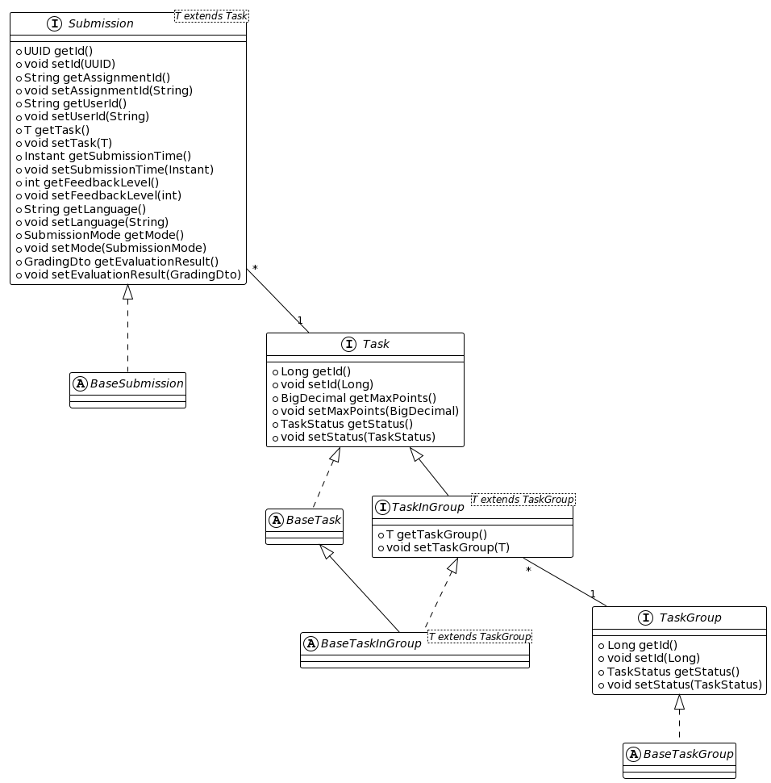
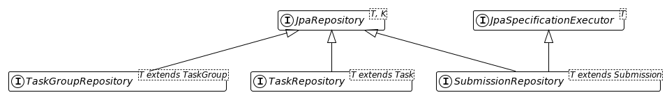
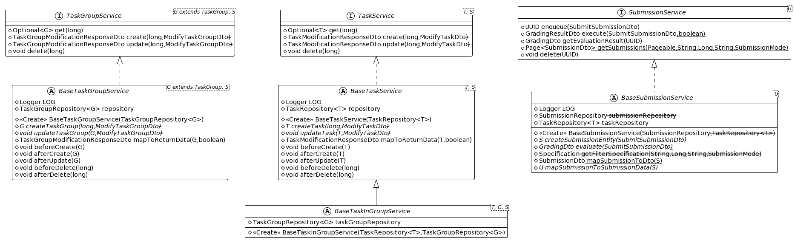
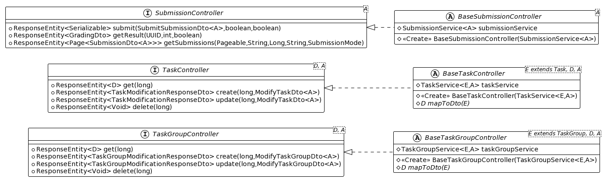

# Library Usage

Task-apps are responsible for evaluating and grading submissions. For each task type (or task types that somehow belong together) a separate, independent task app exists.

## API-Contract

Task apps must provide RESTful API endpoints that are used to create, update, and delete tasks and tasks groups and to submit tasks for evaluation.

Task apps may require authentication using an API key. API keys are sent in the `X-API-KEY` HTTP header.
It is recommended that Task-App clients can be assigned one or more of the following roles:

* __CRUD__: Create, read, update, and delete tasks and task groups.
* __SUBMIT__: Submit submissions
* __READ_SUBMISSION__: Read persisted submissions

The description of the API endpoints can be found at https://etutor-plus-plus.github.io/task-app-starter/api.html.
The OpenAPI specification, from which the documentation is generated can be found at https://github.com/eTutor-plus-plus/task-app-starter/blob/main/openapi.yaml.

The following table briefly describes the endpoints:

| Method   | Endpoint               | Description                                                                                                                                                                                                                                                                                                                                        |
|----------|------------------------|----------------------------------------------------------------------------------------------------------------------------------------------------------------------------------------------------------------------------------------------------------------------------------------------------------------------------------------------------|
| `GET`    | `/api/taskGroup/{id}`  | Returns the task group type specific data of the requested task group.                                                                                                                                                                                                                                                                             |
| `POST`   | `/api/taskGroup/{id}`  | Creates a new task group with the specified identifier. The task-app may return an automatically generated description. This description will be used if the user did not enter a description.                                                                                                                                                     |
| `PUT`    | `/api/taskGroup/{id}`  | Updates the specified task group. The task-app may return an automatically generated description. This description will be used if the user did not enter a description.                                                                                                                                                                           |
| `DELETE` | `/api/taskGroup/{id}`  | Deletes the specified task group.                                                                                                                                                                                                                                                                                                                  |
| `GET`    | `/api/task/{id}`       | Returns the task type specific data of the requested task.                                                                                                                                                                                                                                                                                         |
| `POST`   | `/api/task/{id}`       | Creates a new task with the specified identifier. The task-app may return an automatically generated description, points and difficulty. This description will be used if the user did not enter a description. If the task-app returns points, the existing points will be overridden with the provided one. The same applies for the difficulty. |
| `PUT`    | `/api/task/{id}`       | Updates the specified task. The task-app may return an automatically generated description, points and difficulty. This description will be used if the user did not enter a description. If the task-app returns points, the existing points will be overridden with the provided one. The same applies for the difficulty.                       |
| `DELETE` | `/api/task/{id}`       | Deletes the specified task.                                                                                                                                                                                                                                                                                                                        |
| `GET`    | `/api/submission`      | Returns a paged (and optionally filtered) list of submissions. This might be used e.g. for plagiarism checking.                                                                                                                                                                                                                                    |
| `GET`    | `/api/submission/{id}` | Returns the evaluation result of the requested submission. A timeout may be specified in the header in order to specify how long to wait at maximum for the result to be available.                                                                                                                                                                |
| `POST`   | `/api/submission/{id}` | Submits a new solution. A solution can be submitted to run in background. In this case only the submission identifier will be returned and the result can later be retrieved from the GET endpoint. In the other case the evaluation runs synchronously and the evaluation result is returned.                                                     |

## Starter

Task-Apps can be developed in any programming language, as long as it provides the above-mentioned RESTful API. For applications that are developed in Java with Spring Boot,
this library can be used to develop a task app. The use of this library is optional. This library provides classes for Database-Access, CRUD-Operations on Tasks and
Task-Groups as well as Submissions. Additionally, it provides a ready-to-use implementation for API-key authentication. Developers using this library can choose to only use
parts of the library.

The following subsections briefly describe the different parts of the starter library. For more information, please conduct
the [JavaDoc](https://etutor-plus-plus.github.io/task-app-starter).

### Data Model

The following figure shows the interfaces and classes of the data model. Developers can either use the interfaces or the base-classes to create their own classes for task groups,
tasks and submissions. If a task-app uses Jakarta Persistence API (JPA) for persisting the data, it is recommended to use the base-classes, as these are already configured with
JPA-annotations. An example SQL-DDL script for creating the tables is provided in the JavaDoc of the `at.jku.dke.etutor.task_app.data.entities` package. Tasks belonging to a task
group should implement `TaskInGroup` or extend `BaseTaskInGroup`.

For task-apps using Spring Boot JPA for accessing data, the library provides interfaces in the `at.jku.dke.etutor.task_app.data.repositories` package.
Task-apps must create interfaces that extend this interfaces and specify the implementations of the data model classes/interfaces (TaskGroup, Task, Submission).

### Services

In order to read, create, update and delete tasks and task groups as well as to read and submit submissions, interfaces and default implementations are provided in the
`at.jku.dke.etutor.task_app.services` package (see following figure). The default implementations use Spring Boot JPA Repositories to persist the data. Task-apps can extend
the classes with the default implementation or implement the interfaces with custom logic.

### REST Controllers

The controllers provide the previously described REST-Endpoints in the `at.jku.dke.etutor.task_app.controllers` package (see following figure). The interface method are annotated
with the appropriate request-path matching settings. Task-apps can extend the classes with default implementation or implement the interfaces with custom logic.

### Authentication

Task-apps may require authentication using API-keys. If an API-key is configured in the task administration, the key will be sent in the `X-API-KEY` header. The starter
provides classes for this type of authentication. The allowed API-keys (and their roles) are read from the application configuration. In order to activate the authentication
functionality, create a class that extends `at.jku.dke.etutor.task_app.config.BaseSecurityConfig` and annotate it with `@Configuration`.
